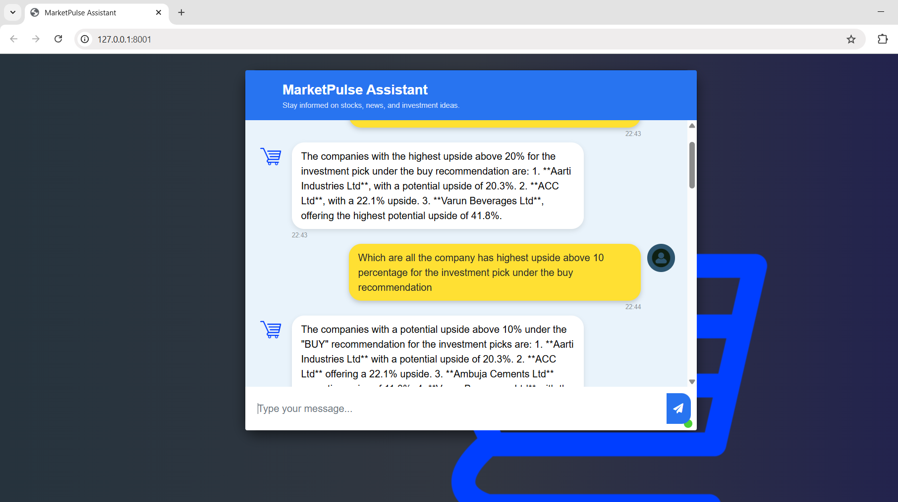

# MarketPulse Assistant RAG

A Retrieval-Augmented Generation (RAG) application for financial document analysis and Q&A, built with FastAPI and Qdrant.

## Features

- **Chat UI**: Ask questions about financial documents and get AI-powered answers.
- **Document Parser**: Used Docling for parsing the tables and text in pdf document
- **Document Chunk Retrieval**: Uses Qdrant vector database for semantic search.
- **MMR Reranking**: Used MMR reranking to reduce the redundancy of results.
- **Custom Retriever**: Retrieves relevant document chunks for your queries.
- **FastAPI Backend**: RESTful endpoints for chat and retrieval.
- **Jinja2 Templates**: Renders the chat interface.
- **Static Assets**: Custom CSS for UI styling.

## Project Structure

```
.env
README.md
requirements.txt
config/
data_ingestion/
data_retriever/
docs/
notebook/
qdrant_storage/
src/
static/
template/
utils/
```

## Getting Started

1. **Install dependencies**
    ```sh
    pip install -r requirements.txt
    ```

2. **Run Qdrant**
    - Make sure Qdrant is running on `localhost:6333` and contains the `document_chunks_rag` collection.

3. **Start the FastAPI server**
    ```sh
    uvicorn src.main:app --reload
    ```

4. **Access the chat UI**
    - Open [http://localhost:8000](http://localhost:8000) in your browser.

## DEMO




## API Endpoints

- `GET /`  
  Renders the chat interface.

- `POST /get`  
  Accepts a form field `msg` (your question) and returns a JSON answer.

## Configuration

- Update Qdrant host, port, and collection in [`src/main.py`](src/main.py) as needed.
- Place your HTML template in [`template/chat.html`](template/chat.html).
- Style your UI in [`static/style.css`](static/style.css).

## Notebooks

- See [`notebook/docling_qdrant.ipynb`](notebook/docling_qdrant.ipynb) for document processing and chunking workflows.
